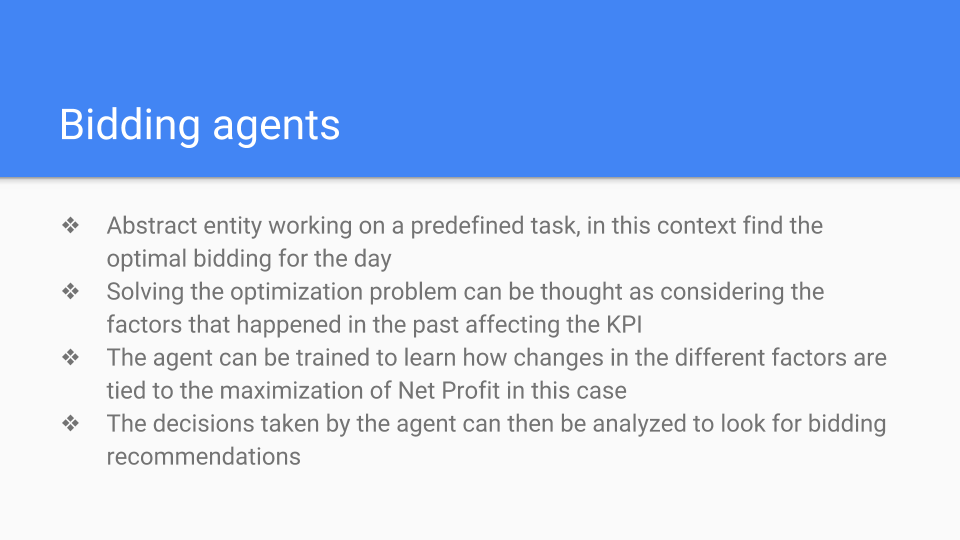
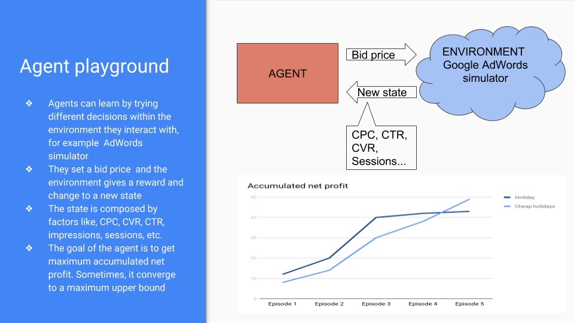
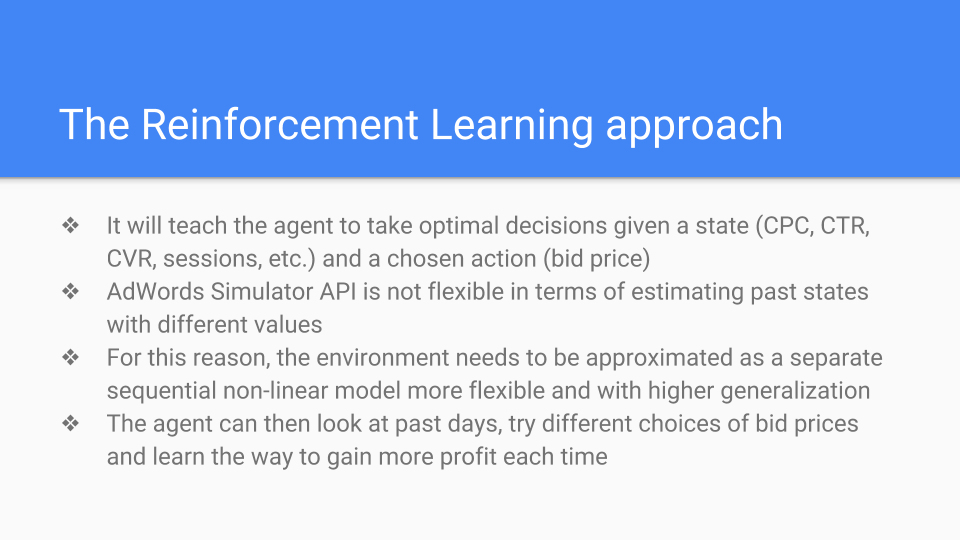
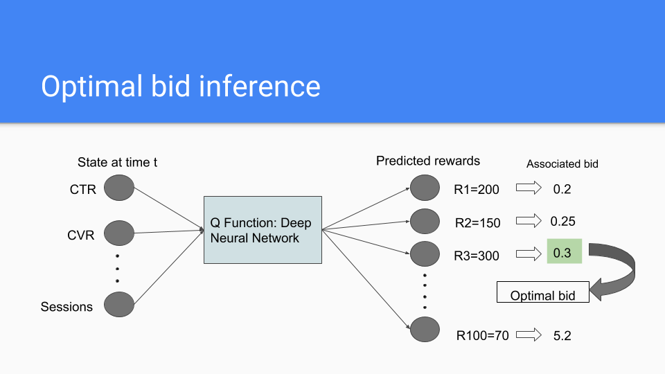

# Automatic bidding system by agents trained by Reinforcement Learning
 Intelligent bidding system for Google AdWords Platform

 This repository only contains the __modelling part of the simulator__ plus the __implementation of Reinforcement Learning agents__ whose goal is
 to choose the optimal bidding price or max_cpc in AdWords terminology.

 At high level it can be explained as follows
 

 

 

 

 At a low level, the python source codes are implementing the following:

 This work is based on the implementation of a RL model for the data given by Google AdWords and described in chapter 4. It is basically taking the ideas from (Jun, et al., 2018) with respect to the agent’s implementation by means of RL control theory. A control system is approached as a Markov Decision Process (MDP) which is mathematically represented as a tuple 〈S,A,p,r〉 where S and A represent the state and action space respectively, p(∙) denotes the transition probability function, and r(∙) denotes the feedback reward function. The transition probability from state s∈S to the next one s'∈S by taking action a∈A is p(s,a,s'). The reward received after taking action a in state s is r(s,a). The goal of the model is to learn an optimal policy, represented by a sequence of decisions, mapping state s to action a, in order to maximize the expected accumulated action reward.

 For this project, it is implemented individual agents for each keyword and each of them is trying to maximize its own net profit goal. It should be noted that the more intuitive idea would be to have multi-agent scenario, in which the agents compete and cooperate in order to achieve a global net profit goal, as it is noted on the work carried out by (Ardi, et al., 2017), the agents would learn to better global bidding performance.
